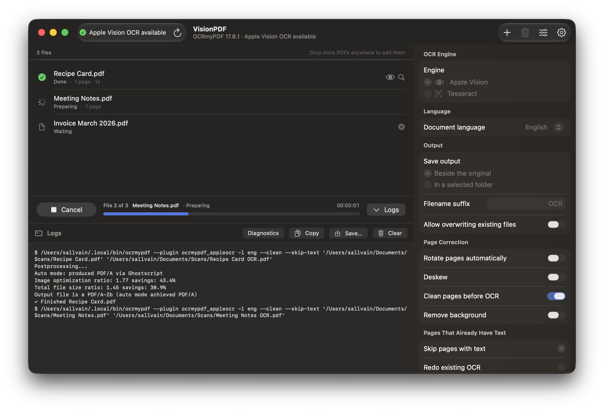
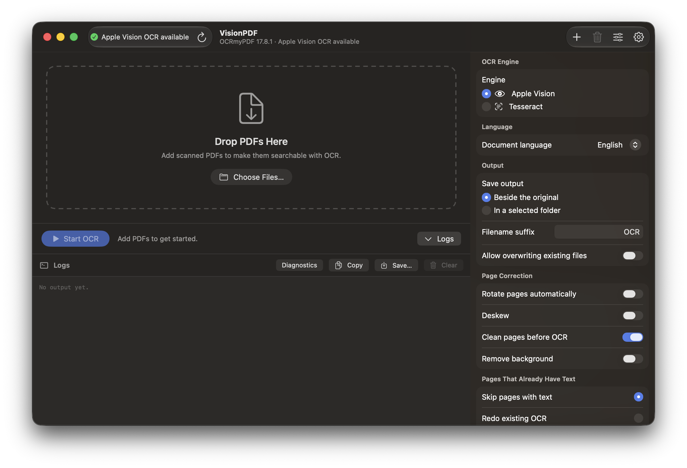
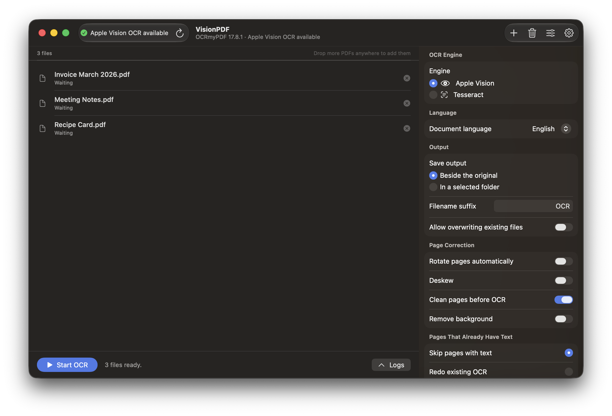
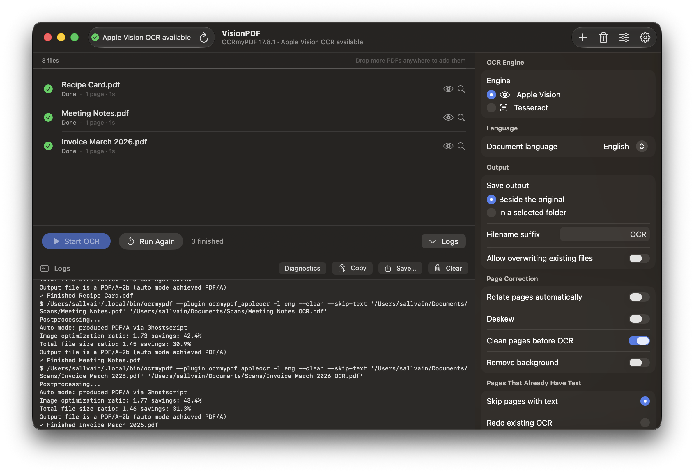
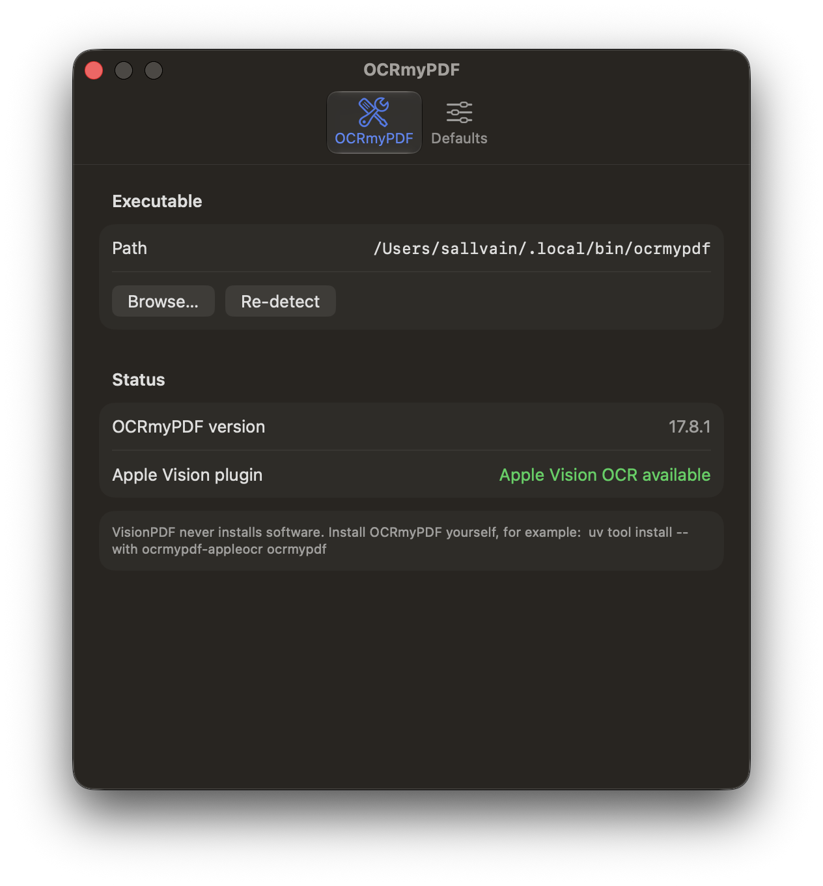

# VisionPDF

A native macOS front end for [OCRmyPDF](https://ocrmypdf.readthedocs.io/). Drop scanned
PDFs in, pick your options, and get searchable PDFs out — using either the
**Apple Vision** OCR engine (via the `ocrmypdf_appleocr` plugin) or OCRmyPDF's
built-in **Tesseract** engine. VisionPDF does not reimplement OCR; it is a safe
GUI wrapper around your existing `ocrmypdf` installation.

Built with Swift 6, SwiftUI, and no third-party dependencies. Targets Apple
Silicon on macOS 15 or later.



## Requirements

- macOS 15+ (developed and tested on macOS 27 / Xcode 27)
- Xcode 16 or newer (Swift 6 toolchain)
- A working OCRmyPDF installation, e.g.:

  ```sh
  uv tool install --with ocrmypdf-appleocr ocrmypdf
  ```

  The Apple Vision plugin is optional — without it, VisionPDF uses Tesseract.
  VisionPDF never installs software itself.

## Building in Xcode

1. Open `VisionPDF.xcodeproj` in Xcode.
2. Select the **VisionPDF** scheme and **My Mac** as the destination.
3. Press **⌘R** to build and run.

From the command line:

```sh
xcodebuild -project VisionPDF.xcodeproj -scheme VisionPDF -configuration Debug build
```

## Running the tests

In Xcode press **⌘U**, or:

```sh
xcodebuild -project VisionPDF.xcodeproj -scheme VisionPDF test
```

The tests cover executable detection, plugin detection, argument construction
(including file names with spaces, parentheses, brackets, and apostrophes),
output naming and duplicate handling, non-writable folders, process
success/failure/cancellation, and the queue's error-handling behavior. Process
execution is mocked where appropriate; a handful of tests exercise the real
`ProcessRunner` against tiny system binaries (`/usr/bin/true`, `/bin/echo`,
`/bin/sleep`).

## Creating a release build and exporting the .app

```sh
xcodebuild -project VisionPDF.xcodeproj -scheme VisionPDF -configuration Release \
  -derivedDataPath build build
open build/Build/Products/Release   # contains VisionPDF.app
```

Copy `VisionPDF.app` to `/Applications` (or anywhere you like).

### Gatekeeper for a locally built app

A locally built, ad-hoc-signed app runs normally when you launch it on the Mac
that built it. If you copy it to another Mac (or it acquires a quarantine flag),
either right-click → **Open** the first time, or clear quarantine:

```sh
xattr -dr com.apple.quarantine /Applications/VisionPDF.app
```

### Optional: signing with a personal Apple Developer identity

In Xcode: project **VisionPDF** → target **VisionPDF** → *Signing &
Capabilities* → set *Team* to your personal team and leave *Automatically
manage signing* on. For distribution to other machines you would additionally
enable Hardened Runtime and notarize; for personal use this is unnecessary.

## Screenshots

| | |
|---|---|
|  |  |
|  |  |

## Architecture

MVVM with a strict separation between pure logic and UI:

```
VisionPDF/
├── Models/            Value types: OCREngine, LanguageChoice, OCRSettings,
│                      QueueItem, ToolStatus
├── Services/          Pure, testable logic
│   ├── ExecutableLocator   Finds ocrmypdf (known paths + login-shell `command -v`),
│   │                       builds the merged PATH environment for child processes
│   ├── ToolDetector        Probes `--version` and `--plugin ocrmypdf_appleocr --help`
│   ├── CommandBuilder      OCRSettings → structured [String] argument array
│   ├── OutputNaming        Suffix naming, batch-duplicate numbering, pre-flight validation
│   ├── ProcessRunner       Foundation.Process wrapper: streaming output, cancellation
│   │                       (SIGTERM → SIGKILL), timeouts; mockable via ProcessRunning
│   ├── ProgressParser      Maps observed OCRmyPDF stderr milestones to stages;
│   │                       OCRExitCode maps exit codes to human-readable errors
│   └── Diagnostics         Environment/run summary for the log panel
├── ViewModels/
│   ├── AppModel            Detection state + persisted settings (composition root)
│   └── QueueController     Queue state machine; sequential processing driver
└── Views/             SwiftUI: main window, drop zone, queue list, options
                       inspector, processing bar, log panel, Settings, first launch
```

Key decisions:

- **No shell, ever.** OCRmyPDF is launched with `Process.executableURL` plus a
  structured `arguments` array. Paths containing spaces, quotes, parentheses,
  brackets, or `$(...)` pass through byte-for-byte. The "command" shown in the
  UI is a quoted rendering for display only. The only shell the app runs is a
  fixed-string `zsh -l -c "command -v ocrmypdf"` / `printf %s "$PATH"` probe
  during detection — no user input is ever interpolated into it.
- **PATH repair.** Finder-launched apps get a minimal PATH that would break
  OCRmyPDF's own subprocesses (`tesseract`, `gs`, `unpaper`). VisionPDF captures
  the login-shell PATH once and merges it (plus known tool directories) into the
  child environment.
- **Language handling.** Both engines receive ISO 639-2 codes via `-l`. Multiple
  languages are emitted as separate `-l` flags because the Apple plugin rejects
  Tesseract-style `eng+spa` in one value while both engines accept repetition.
  "Automatic" maps to `-l und`, which the plugin only supports in fast/accurate
  recognition modes — the builder forces `--appleocr-recognition-mode accurate`
  when needed and the UI explains this.
- **Honest progress.** With stderr piped, OCRmyPDF emits milestone lines but no
  reliable percentages, so the per-file bar is indeterminate with parsed stage
  labels ("Recognizing text", "Postprocessing", "Optimizing", …), and the
  determinate bar tracks queue completion (real numbers). No faked percentages.

## Sandbox tradeoff

The App Sandbox is **disabled** for this project, deliberately. A sandboxed app
cannot usefully exec a user-installed `ocrmypdf` (a uv-managed Python
virtualenv in `~/.local/share/uv/...`), which in turn spawns `tesseract`,
Ghostscript, and temporary-file machinery all over the file system. Entitlement
workarounds do not cover arbitrary user-installed interpreters. Since the goal
is a working personal utility — not Mac App Store distribution — the app runs
unsandboxed with ad-hoc signing. Consequences: no App Store; the app has your
full user-level file access (like any Terminal command you run today).

## Known limitations

- Per-file progress is stage-based, not percentage-based (OCRmyPDF only emits
  usable percentages to a TTY; see "Honest progress" above).
- "Clean pages" (`--clean`) and levels 2–3 of optimization depend on optional
  helper tools (`unpaper`, `pngquant`) that OCRmyPDF looks for at runtime. If
  they are missing, OCRmyPDF fails with exit code 3 and VisionPDF surfaces the
  message — it does not pre-install or pre-check them.
- Tesseract language availability depends on the installed tessdata packs
  (`tesseract --list-langs`); choosing Spanish without `spa` installed fails
  with a clear OCRmyPDF error in the logs.
- Automatic language detection requires the Apple Vision plugin (fast/accurate
  modes); it is not available with Tesseract.
- Files are processed sequentially by design; parallelism is per-file via
  OCRmyPDF's own `--jobs`.
- The queue is not persisted across app launches.

## License

[MIT](LICENSE)
